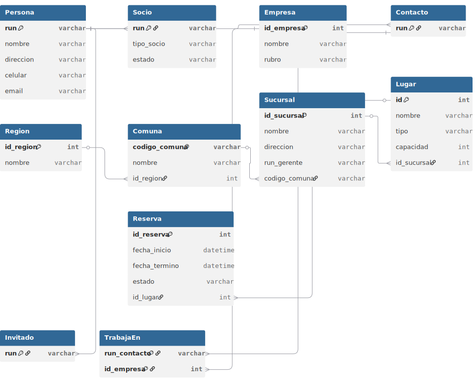

# Informe Entrega 1 - Bases de datos IIC2413

## Datos del Alumno
| **Apellidos**       | **Nombres**          | **Número de Alumno** |
|---------------------|----------------------|----------------------|
| Navarro Aragón      | Antonio              |25663259              |


## 1. Descripción y análisis del problema
 
    El problema describe el funcionamiento de un club deportivo genérico llamado DCColo, con distintas entidades modelables, y sobre todo, distintos datos que necesitan ser almacenados y accedidos de formas eficientes para el correcto funcionamiento del establecimiento. Dentro de esta base de datos (y del propio funcionamiento del club) existen determinadas restricciones para el modelado de su base de datos relacional. Entre ellas distintos tipos de membresías con distintas atribuciones cada una. Multiples sucursales y multiples servicios ofrecidos donde cada uno requiere su propia estructura de base de datos. 

> [!NOTE]
> 0% IA

## 2. Solución aplicada

	Para poder modelar esta base de datos, se basó principalmente en la jerarquía de PERSONAS, ya que todo gira primordialmente en torno a las distintas personas que hacen uso del club DCColo; ya sean socios, contactos, invitados, clientes o administradores. De ahí derivan las posibles interacciones con el club como ente: ya sea arrendando instalaciones, organizando eventos, visitando sucursales, etc.
    Muchas de las relaciones son de 1 a N, ya que una persona puede realizar multiples acciones.
    El modelo resuelve aspectos de redundancia, al estar normalizado y no tener datos similares en ninguna de sus tablas, manejando todo con llaves foráneas y conjunciones con otras tablas. Las llaves primarias fueron elegidas cuidadosamente para evitar colisiones, todas son llaves candidatas ya sea por ID, o por un identificador único como el RUN. Es una base simple sin mucha complejidad para eficientar los procesos de obtención y manipulación de datos.

> [!NOTE]
> 0% IA

### 2.1 Modelo Entidad Relación


> [!NOTE]
> %IA: 15%; Claude Sonnet 4.6: <br>
"Estoy modelando un proyecto para mi curso de base de datos, ayudame a revisar como voy, que errores fatales tengo y encaminame hacia un buen modelo E/R normalizado en BCNF para mi base de datos relacional. Te adjunté mi modelo E/R hasta ahora y el enunciado general y especifico de esta parte del proyecto."

### 2.2 Modelo Entidad Relación normalizado

> [!NOTE]
> %IA: 60%; Claude Sonnet 4.6: <br>
“Estoy modelando un proyecto para mi curso de bases de datos. Ayúdame a revisar mi diagrama E/R y el enunciado, detectar errores importantes y orientarme para llevarlo a un modelo relacional bien hecho en BCNF. También conviértelo a DBML respetando lo que ya tengo”

### 2.3 Consultas SQL
<bi>a)</bi> Despliegue (como un listado) la agenda de la sucursal ”Santa Cruz”para la semana que comienza el 6 de abril 2026, indicando el dia, la fecha, la hora y el evento o nombre del socio que tiene reservado cada lugar. El listado debe estar Agrupado por día, hora y lugar
```SQL
SELECT 
    TO_CHAR(r.fecha_inicio, 'Day') AS dia,
    DATE(r.fecha_inicio) AS fecha,
    TO_CHAR(r.fecha_inicio, 'HH24:MI') AS hora,
    l.nombre AS lugar,
    p.nombre AS socio
FROM Reserva r
JOIN Lugar l ON r.id_lugar = l.id
JOIN Sucursal s ON l.id_sucursal = s.id_sucursal
JOIN Socio so ON r.run_socio = so.run
JOIN Persona p ON so.run = p.run
WHERE s.nombre = 'Santa Cruz'
  AND r.fecha_inicio >= '2026-04-06'
  AND r.fecha_inicio < '2026-04-13'
ORDER BY fecha, hora, lugar;
```
<br>

<bi>b)</bi> Calcule y despliegue el monto del ingreso mensual (mes actual) por concepto de membresías, reservas ejecutadas y eventos de la misma sucursal agrupados por ingresos efectivamente recibidos e ingresos futuros esperados.

```SQL
SELECT 
    s.nombre AS sucursal,
    SUM(CASE 
        WHEN c.pagada = true THEN c.monto 
        ELSE 0 
    END) AS ingresos_recibidos,
    
    SUM(CASE 
        WHEN c.pagada = false THEN c.monto 
        ELSE 0 
    END) AS ingresos_esperados,
    
    SUM(rp.monto) AS ingresos_reservas

FROM Sucursal s

LEFT JOIN Socio so ON so.id_sucursal = s.id_sucursal
LEFT JOIN Membresia m ON m.run_socio = so.run
LEFT JOIN Cuota c ON c.id_membresia = m.id_membresia

LEFT JOIN Lugar l ON l.id_sucursal = s.id_sucursal
LEFT JOIN Reserva r ON r.id_lugar = l.id
LEFT JOIN PagoReserva rp ON rp.id_reserva = r.id_reserva

WHERE EXTRACT(MONTH FROM CURRENT_DATE) = EXTRACT(MONTH FROM c.fecha_vencimiento)

GROUP BY s.nombre;
```
<br>

<bi>c)</bi> Extraiga un reporte de todos los socios con sus cuotas atrasadas (membresías y adicionales) incluyendo nombre completo, RUN, sucursal, monto y número de cuotas.

```SQL
SELECT 
    p.nombre,
    p.run,
    s.nombre AS sucursal,
    c.monto,
    COUNT(c.id_cuota) AS numero_cuotas

FROM Cuota c
JOIN Membresia m ON c.id_membresia = m.id_membresia
JOIN Socio so ON m.run_socio = so.run
JOIN Persona p ON so.run = p.run
JOIN Sucursal s ON so.id_sucursal = s.id_sucursal

WHERE c.pagada = false
  AND c.fecha_vencimiento < CURRENT_DATE

GROUP BY p.nombre, p.run, s.nombre, c.monto;
```
<br>

<bi>d)</bi> Genere el listado de todos los beneficiarios-hijos y datos de su socio titular que en la próxima renovación de la membresía deben pagar un costo adicional (cumplen 29 años). Los datos de los beneficiarios y del socio deben ser RUN, nombre completo, correo, teléfono celular en una sola línea por beneficiario

```SQL
SELECT 
    pb.run AS run_beneficiario,
    pb.nombre AS nombre_beneficiario,
    pb.email,
    pb.celular,

    pt.run AS run_titular,
    pt.nombre AS nombre_titular,
    pt.email,
    pt.celular

FROM Socio sb
JOIN Persona pb ON sb.run = pb.run

JOIN Socio st ON sb.run_titular = st.run
JOIN Persona pt ON st.run = pt.run

WHERE sb.tipo_socio = 'beneficiario'
  AND EXTRACT(YEAR FROM AGE(CURRENT_DATE, pb.fecha_nacimiento)) = 28;
```
<br>

<bi>e)</bi> Genere un reporte para del año 2025 de todas las sucursales incluyendo nombre de la sucursal, gerente a cargo, ingresos totales de la sucursal y porcentaje del total del Club Social y Deportivo DCColo del año 2025, ordenado de mayor a menor por ingreso.

```SQL
WITH ingresos_sucursal AS (
    SELECT 
        s.id_sucursal,
        s.nombre,
        s.run_gerente,

        COALESCE(SUM(c.monto), 0) +
        COALESCE(SUM(rp.monto), 0) AS ingreso_total

    FROM Sucursal s

    LEFT JOIN Socio so ON so.id_sucursal = s.id_sucursal
    LEFT JOIN Membresia m ON m.run_socio = so.run
    LEFT JOIN Cuota c ON c.id_membresia = m.id_membresia
        AND c.pagada = true
        AND EXTRACT(YEAR FROM c.fecha_vencimiento) = 2025

    LEFT JOIN Lugar l ON l.id_sucursal = s.id_sucursal
    LEFT JOIN Reserva r ON r.id_lugar = l.id
    LEFT JOIN PagoReserva rp ON rp.id_reserva = r.id_reserva
        AND EXTRACT(YEAR FROM r.fecha_inicio) = 2025

    GROUP BY s.id_sucursal, s.nombre, s.run_gerente
),

total_club AS (
    SELECT SUM(ingreso_total) AS total FROM ingresos_sucursal
)

SELECT 
    i.nombre AS sucursal,
    p.nombre AS gerente,
    i.ingreso_total,
    (i.ingreso_total / t.total) * 100 AS porcentaje

FROM ingresos_sucursal i
JOIN total_club t ON true
LEFT JOIN Persona p ON i.run_gerente = p.run

ORDER BY i.ingreso_total DESC;
```
<br>

> [!NOTE]
> %IA: 80%; GPT-5: <br>
“Ahora en base a todo lo que te he enviado de mi proyecto, y manteniendo coherencia con mi modelo E/R y diagrama responde a las siguientes consultas en SQL."

## 3. Referencias y bibliografía externa
No se usaron referencias o bibliografía externa para esta etapa del proyecto además del material de clases publicado en el [repo oficial del curso](https://github.com/IIC2413/Syllabus-2026-1-s1-2/).